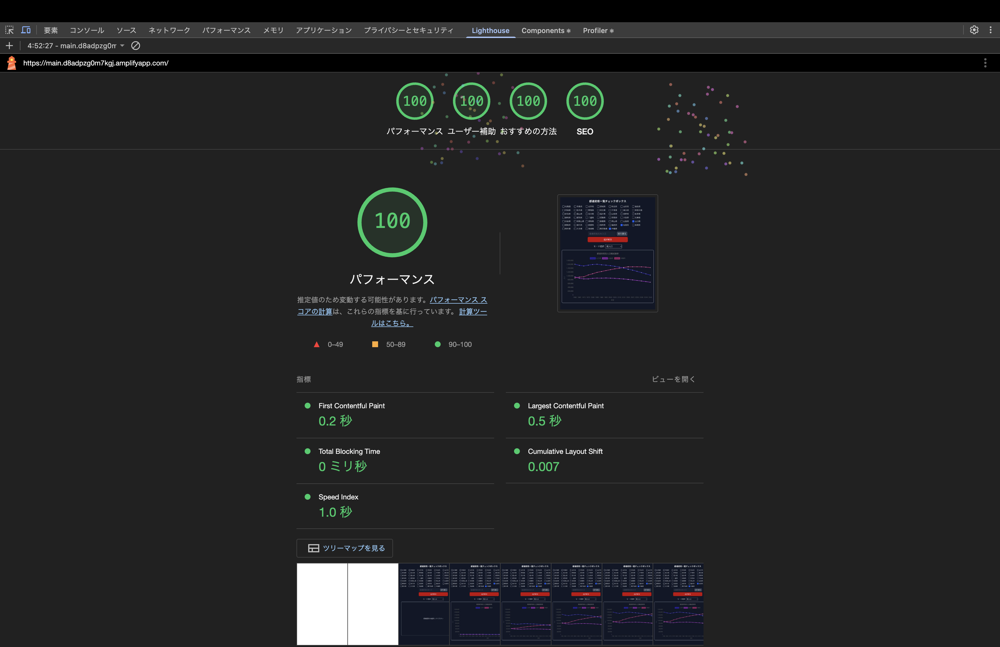

# 本プロジェクトについて

**本プロジェクトは株式会社ゆめみ様のフロントエンドコーディング試験に挑戦した記録です。**

トータル作業時間約**54**時間

## 💎 本プロジェクトの押しポイント7選

- #### AWS AppSyncを使ったリアルタイム共同作業の実現
- #### コメントやJSDocで他者にもわかりやすいコードを意識
- #### NEXT_PUBLICなどの適切な使い分け
- #### 開発用・本番用でGitブランチを分けて管理
- #### Copilotのコードレビュー機能でチーム開発の擬似体験
- #### GitHub Projectsを用いたタスク管理
- #### LightHouseによるパフォーマンス最適化

## [🔗 試験課題](https://yumemi.notion.site/0e9ef27b55704d7882aab55cc86c999d)

**都道府県別の総人口推移グラフを表示するSPA(Single Page Application)を構築せよ**

## 🧰 技術スタック

### 💻 プログラミング言語

- TypeScript

### ⚙️ フレームワーク・ライブラリ

- Next.js App Router
- Tailwind CSS

### 📦 パッケージ管理

- npm

### 📊 チャート

- react-chartjs-2

### 🧠 状態管理

- Jotai

### 🧪 テスト

- Jest

### 🧹 Linter / Formatter

- ESLint
- Prettier

## 本プロジェクトを通して初めて扱った技術

- react-chartjs-2
- Jotai
- Jest

## LightHouseによるパフォーマンス測定(2025/04/19/06:00)



## 💡 工夫した点・意識した点

- 本プロジェクトに取り組むにあたり、「どのような機能があればより便利か」について考えました。その結果、「複数人で同時に作業ができたら便利なのでは？」という結論に至りました。しかし、ここで問題があり、VercelだとWebsocketが非対応でリアルタイム通信ができません。なので私は、 そこで、ホスティングをVercelからAmplifyに移行し、AppSyncとDynamoDBを用いてリアルタイム通信を実現しました。

- 「チーム開発を意識してのGit/GitHubの活用ができているか」と書いてあったので、開発branchとメインbranchを分けたり、Copilotのコードレビュー機能を使って一人だけで、実際にチーム開発を再現してみました。また、コミットメッセージの接頭辞も意識し、可読性と管理のしやすさを重視しました。これまで接頭辞を明確に設けた経験が少なかったのですが、本プロジェクトを通じて適切な命名規則を模索し、徐々に最適化できるようになりました。

- 本プロジェクトでは、株式会社ゆめみ様のAPIでprefecturesとpopulationCompositionを使用しましたが、どちらも基本的にはデータが変わることがないのでfetchするときのオプションに「force-cache」を指定し、キャッシュがあればキャッシュから取得する設定にしました。

## 今後の展望

- 実装が間に合わなかったroomIdごとのリアルタイム共同作業
- useCallbackやuseMemoを使ってパフォーマンスの向上
- ダウンロード機能の実装など

## 本プロジェクトを通して

- #### たくさんの新しい技術に触れるいい機会だった!
- #### チーム開発を意識して開発をする大変さを知った!
- #### Gitに関する知識が10倍くらい増えた!
- #### AmplifyのSSRで環境変数を使うには工夫が必要だった！
- #### もう少し時間をとって取り組みたかった…

## 開発方法

### 0. 本プロジェクトのリポジトリをクローンしてください。

```
git clone https://github.com/kmjak/yumemi-coding-test-2025-04.git
cd yumemi-coding-test-2025-04
```

### 1. vscodeで本プロジェクトを開き推奨拡張機能をインストールしてください

### 2. パッケージをインストールしてください

```
npm install
```

### 3. Amazon Web Serviceにログインをしてください

### 4. Amazon Web ServiceでDynamoDBを作成してください

- テーブル名を入力してください
- パーティションキー名にroomIdと入力し作成してください
- その他はデフォルトで大丈夫です
- dynamoDBの項目を探索から作ったテーブルを指定して探索します
- 返された項目から項目を作成を押してください。
- roomIdにroom1と入力し項目を作成してください

### 5. Amazon Web ServiceでAppSync(Graphql API)を作成してください

- GraphQL APIデータソースをDynamoDB テーブルから始めるに変更してください
- API名を決めてください
- フィールドにprefCodesをIntの配列にしてください。また、必須にしてください
- その他はデフォルトで大丈夫です

### 6. Appsyncのcodegenを実行してください

以下の: の後となるように入力してください

```
npx @aws-amplify/cli codegen add --apiId your-api-id --region your-region

- ? Choose the type of app that you're building: javascript
- ? What javascript framework are you using: react
- ? Choose the code generation language target: typescript
- ? Enter the file name pattern of graphql queries, mutations and subscriptions: src/graphql/\*_/_.ts
- ? Do you want to generate/update all possible GraphQL operations - queries, mutations and subscriptions: Yes
- ? Enter maximum statement depth [increase from default if your schema is deeply nested]: 2
- ? Enter the file name for the generated code: src/types/models/graphql/GraphqlSchema.ts
- ? Do you want to generate code for your newly created GraphQL API: Yes
```

### 7. .env.localの設定をしてください

.env.exampleをコピーし、.env.localと名前を変更してください
例: Mac、Linux

```
cp .env.example .env.local
```

コピーが完了したら環境変数名に合うように値を埋めてください。

### 8. 開発環境を立ち上げてみましょう

```
npm run dev
```

### 9. localhost:3000(デフォルト)にアクセスしてください。

注意: すでに3000番ポートが使用されている場合3001番が使用されます。

## [🔗 デプロイ](https://main.d8adpzg0m7kgj.amplifyapp.com/)

デプロイ先: https://main.d8adpzg0m7kgj.amplifyapp.com/

デプロイ方法: Amazon Web Serviceの Amplifyを使用しています

## 補足

ESLintに則っているか確かめる方法

```
npm run lint
```

Testコードを実行する

```
npm test
```
